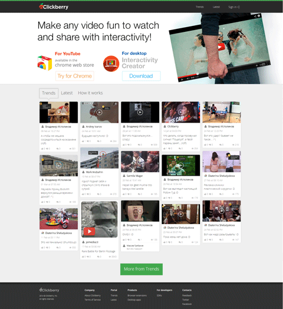
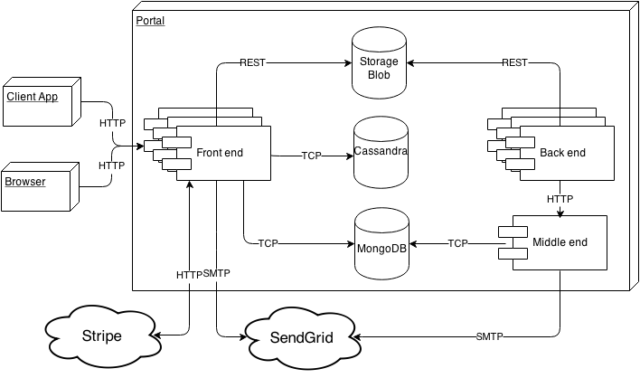

# Clickberry Portal

Clickberry Portal is a distributed software system which powered by Microsoft Azure. It's designed and implemented for quick interactive video delivery to various devices and platforms.

## Demo

You can see Portal demonstration at the following link: [https://clickberry.tv](https://clickberry.tv)

## Overview

Exposing unified cross-platform multifunctional RESTful API for authentication and authorization, user profile management, interactive video projects and user files management, Portal stands as a back-end service for mobile and desktop applications.

Integrated video metadata analysis and video encoding capabilities allow Portal to take the burden of heavy computational tasks away from client and provide cross-platform multimedia delivery.

Multimedia content delivery is provided via progressive download technology by leveraging Azure Storage Blob services, avoiding performance bottlenecks and bandwidth starvation.

## Wiki
You can find more information about project at our [Wiki pages](../../wiki).

## How to Install
Portal installation documentation can be find at [How to Install](../../wiki/How%20to%20Install) wiki section.

## Services

### Portal
Portal cloud service looks like follows:

Portal consists of Front-end, Middle-end and Back-end service and interact with 3rd party service like SendGrid or Stripe.
Client applications uses Portal API which is a REST API created for user, interactive video and file management scenarios.
Users via browsers can authenticate on Portal via Social Network or email/password pair and view, manage their interactive videos.

#### Front-end
It's a Web Role which consists of the following virtual applications in IIS:

* Web - ASP.NET MVC application which delivers Web UI via HTTP.
* API - ASP.NET Web API application which provides REST endpoint for client apps.

Front-end designed and implemented to be scalable both horizontally and vertically.
It provides public endpoints for client applications.

#### Middle-end
It's a Web Role which contains following applications:

* API - ASP.NET Web API application which provides REST API for back-end servers.
* Scheduler - Background service which on daily basis aggregates statistics data.

#### Back-end
It's a Worker Role which hosts background service for processing video encoding tasks:

* Video encoding
* Screenshot creation

Back-end designed and implemented to be scalable both horizontally and vertically.

### Link Tracker
Link Tracker cloud service decomposition is as follows.

#### Front-end
It's a Web Role which hosts following application:

* API - ASP.NET Web API application which provides REST endpoint for URL tracking.

Front-end designed and implemented to be scalable both horizontally and vertically.
It provides public endpoints for customer-facing scenarios.

#### Middle-end
It's a Worker Role which contains following applications:

* Billing Synchronization - background service which controls clients balance according to their tariff plans.

## License

Clickberry Portal uses [GNU GENERAL PUBLIC LICENSE 3.0](LICENSE) license for code.
